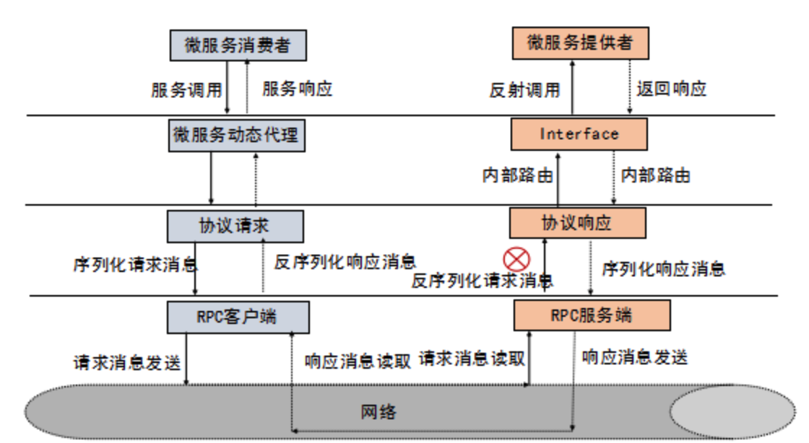

# go-rpc study

这个Project是为了深入的掌握 RPC系统知识。

## 前置知识 - RPC

### 什么是RPC

RPC 代指远程过程调用（Remote Procedure Call），它的调用包含了传输协议和编码（对象序列号）协议等等。允许运行于一台计算机的程序调用另一台计算机的子程序，而开发人员无需额外地为这个交互作用编程

## RPC框架调用原理

### 实际场景

有两台服务器，分别是 A、B。在 A 上的应用 C 想要调用 B 服务器上的应用 D，它们可以直接本地调用吗？ 答案是不能的，但走 RPC 的话，十分方便。因此常有人称使用 RPC，就跟本地调用一个函数一样简单

### RPC框架

业界主流的 RPC 框架整体上分为三类：

+ 支持多语言的 RPC 框架，比较成熟的有 Google 的 gRPC、Apache（Facebook）的 Thrift；
+ 只支持特定语言的 RPC 框架，例如新浪微博的 Motan；
+ 支持服务治理等服务化特性的分布式服务框架，其底层内核仍然是 RPC 框架, 例如阿里的 Dubbo。

| \      | 跨语言 | 多 IDL | 服务治理 | 注册中心 | 服务管理 |
| ------ | ------ | ------ | -------- | -------- | -------- |
| gRPC   | √      | ×      | ×        | ×        | ×        |
| Thrift | √      | ×      | ×        | ×        | ×        |
| Rpcx   | ×      | √      | √        | √        | √        |
| Dubbo  | ×      | √      | √        | √        | √        |

## 学习目标

+ 系统掌握RPC原理
+ 掌握RPC操作和使用
+ 实现自己的RPC框架

## 学习大纲

### 原理、操作与使用篇

| 框架 | Github                                 | 博客 | 备注 |
| ---- | -------------------------------------- | ---- | ---- |
| gRPC | https://github.com/Yefangbiao/rpc/tree/main/grpc | [gRPC](https://www.jianshu.com/c/b892c3c82ad4)     |      |

## 参考内容

+ [极客时间-RPC实战与核心原理](https://time.geekbang.org/column/intro/280)
+ [极客兔兔-7天用Go从零实现系列](https://github.com/geektutu/7days-golang)