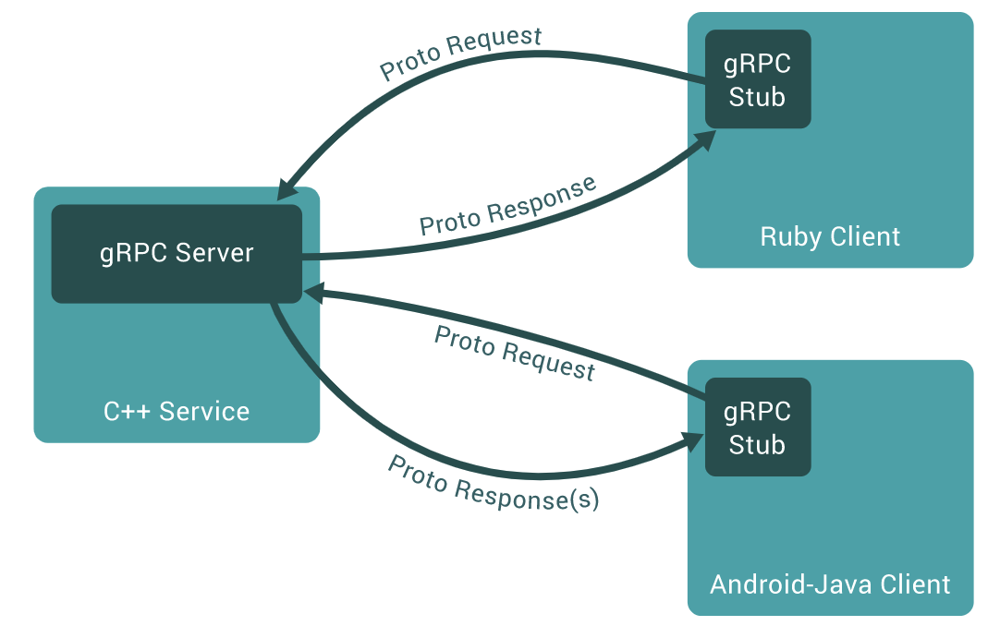

# gRPC入门

## Protobuf

Protocol Buffers 是一种与语言、平台无关，可扩展的序列化结构化数据的方法，常用于通信协议，数据存储等等。相较于 JSON、XML，它更小、更快、更简单，因此也更受开发人员的青眯

如果你还不熟悉`protocol buffer`，请移步[这里](https://developers.google.com/protocol-buffers/docs/overview)

## gRPC
gRPC 是一个高性能、开源和通用的 RPC 框架，面向移动和 HTTP/2 设计

###**特点**

+ 语言中立，支持多种语言；
+ 基于 IDL 文件定义服务，通过 proto3 工具生成指定语言的数据结构、服务端接口以及客户端 Stub；
+ 通信协议基于标准的 HTTP/2 设计，支持双向流、消息头压缩、单 TCP 的多路复用、服务端推送等特性，这些特性使得 gRPC 在移动端设备上更加省电和节省网络流量；
+ 序列化支持 PB（Protocol Buffer）和 JSON，PB 是一种语言无关的高性能序列化框架，基于 HTTP/2 + PB, 保障了 RPC 调用的高性能。

### **调用示例**



说明：

1、客户端（gRPC Sub）调用 A 方法，发起 RPC 调用

2、对请求信息使用 Protobuf 进行对象序列化压缩（IDL）

3、服务端（gRPC Server）接收到请求后，解码请求体，进行业务逻辑处理并返回

4、对响应结果使用 Protobuf 进行对象序列化压缩（IDL）

5、客户端接受到服务端响应，解码请求体。回调被调用的 A 方法，唤醒正在等待响应（阻塞）的客户端调用并返回响应结果


## 第一个gRPC程序

### 前置条件

使用以下命令为Go安装协议编译器插件

```go
go install google.golang.org/protobuf/cmd/protoc-gen-go @lastest
go install google.golang.org/grpc/cmd/protoc-gen-go -grpc@v1.1
```

###### 基本引导

+ 在``proto`文件定义一个服务
+ 使用`protocol buffer compiler`产生服务端和客户端代码
+ 使用Go gRPC API来实现一个简单的客户端和服务端


借助gRPC，我们可以在`.proto`文件中一次性定义我们的服务，并以gRPC支持的任何语言生成客户端和服务器，这些客户端和服务器又可以在从大型数据中心内的服务器到您自己的平板电脑的环境中运行---–
gRPC为您处理不同语言和环境之间的通信。我们还获得了使用`protocol buffer`的所有优点，包括高效的序列化，简单的IDL和容易的接口更新。


### 运行HelloWorld

我们尝试运行官方的代码示例

定义proto文件,使用`protoc --go_out=plugins=grpc:. *.proto`命令生成`.pb.go`文件

```go
syntax = "proto3";

// 包名
package  proto;

// 指定输出 go 语言的源码到哪个目录以及文件名称
// 最终在 test.proto 目录生成 test.pb.go
// 也可以只填写 "./"
option go_package = "./;test";

// 如果要输出其它语言的话
// option csharp_package="MyTest";

// The greeting service definition.
service Greeter {
  // Sends a greeting
  rpc SayHello (HelloRequest) returns (HelloReply) {}
}

// The request message containing the user's name.
message HelloRequest {
  string name = 1;
}

// The response message containing the greetings
message HelloReply {
  string message = 1;
}
```


**客户端**

```go

const PORT = "50051"

func main() {
	// 创建与给定目标（服务端）的连接交互
	conn, err := grpc.Dial("localhost:"+PORT, grpc.WithInsecure(), grpc.WithBlock())
	if err != nil {
		log.Fatalf("grpc.Dial err: %v", err)
	}
	defer conn.Close()

	// 创建grpc客户端
	client := pb.NewGreeterClient(conn)
	// 发送 RPC 请求，等待同步响应，得到回调后返回响应结果
	resp, err := client.SayHello(context.Background(), &pb.HelloRequest{
		Name: "Gopher",
	})
	if err != nil {
		log.Fatalf("client.Search err: %v", err)
	}

	// 输出响应结果
	log.Printf("resp: %s", resp)
}

```


**服务端**

```go
const PORT = "50051"

func main() {
	// 创建 gRPC Server 对象，你可以理解为它是 Server 端的抽象对象
	server := grpc.NewServer()
	// 将 SayHello（其包含需要被调用的服务端接口）注册到 gRPC Server 的内部注册中心。
	//这样可以在接受到请求时，通过内部的服务发现，发现该服务端接口并转接进行逻辑处理
	pb.RegisterGreeterServer(server, &GreetService{})

	// 创建 Listen，监听 TCP 端口
	lis, err := net.Listen("tcp", ":"+PORT)
	if err != nil {
		fmt.Printf("net.Listen err: %v", err)
		return
	}

	// gRPC Server 开始 lis.Accept，直到 Stop 或 GracefulStop
	server.Serve(lis)
}

// 实现SayHello
type GreetService struct{}

func (s *GreetService) SayHello(ctx context.Context, r *pb.HelloRequest) (*pb.HelloReply, error) {
	return &pb.HelloReply{Message: "Hello," + r.GetName()}, nil
}

```


## 遇到问题

1.golang开启mod后import报红解决

[解决方法](https://zhuanlan.zhihu.com/p/93508676)

2.`protoc --go_out=plugins=grpc:. *.proto`使用报错

解决方法：

```go
go get github.com/gogo/protobuf/protoc-gen-gofast
protoc --gofast_out=plugins=grpc:. *.proto
```

