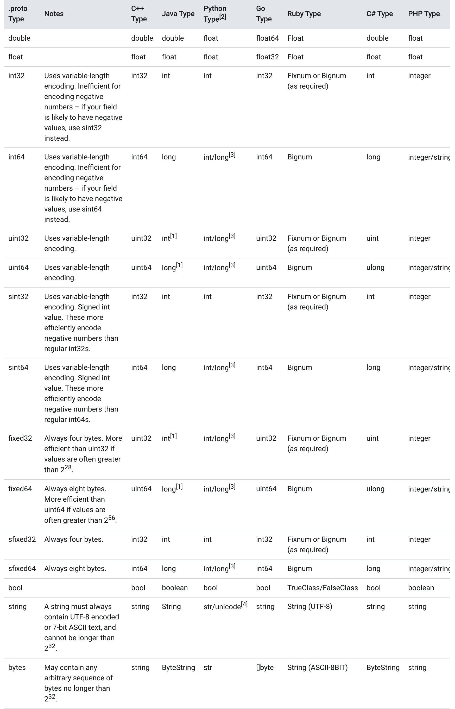

#### ProtoBuf

参考网址：https://developers.google.com/protocol-buffers/docs/proto3

ProtoBuf是Google的与语言无关，与平台无关，可扩展的机制，用于对结构化数据进行序列化–以XML为例，但更小，更快，更简单。您定义要一次构造数据的方式，然后可以使用生成的特殊源代码轻松地使用各种语言在各种数据流中写入和读取结构化数据。


##### Defining A Message Type

定义一个消息格式

```protobuf
syntax = "proto3";

message SearchRequest {
  string query = 1;
  int32 page_number = 2;
  int32 result_per_page = 3;
}
```

+ 第一行：`syntax = "proto3";` 如果你不指定的话，默认使用`proto2`
+ `SearchRequest`定义了具体的三个属性(name/value pairs)，每个字段包含名称和类型

###### **Specifying Field Types**

属性类型是一个（scalar types）标量类型,你可以自定义一个枚举类型，后面我们会提到这一点


###### **Assigning Field Numbers**

每一个信息有一个唯一的数值（unique number）

这个字段被用来定义`message binary format`消息二进制格式。并且一旦确定并使用了不应该被改变。在`1-15`之间使用一个字节，在`16-2047`使用两个字节。

最小的数字是1，最大的数字是`2^29 - 1`，同时`19000-19999`是官方使用的字段，你也不可以使用


###### Specifying Field Rules

消息字段可以是以下两种之一

+ singular:这个字段可以有0个或1个。这是proto3默认的
+ repeated:这个字段可以是0个或无线多个。`repeated`默认使用`packed`编码


###### Adding More Message Types

你一个在一个`.proto`添加多个message

```protobuf
message SearchRequest {
  string query = 1;
  int32 page_number = 2;
  int32 result_per_page = 3;
}

message SearchResponse {
 ...
}
```


###### Adding Comments

增加注释

使用`//`或者`/*...*/`

```protobuf
/* SearchRequest represents a search query, with pagination options to
 * indicate which results to include in the response. */

message SearchRequest {
  string query = 1;
  int32 page_number = 2;  // Which page number do we want?
  int32 result_per_page = 3;  // Number of results to return per page.
}
```


###### Reserved Fields

保留字段，如果你更新了message，删除了一些字段，并且将来有些人重用了这些number。可能会造成一些问题。你可以保留这些number（可能的话保留字段名）

```protobuf
message Foo {
  reserved 2, 15, 9 to 11;
  reserved "foo", "bar";
}
```


###### What's Generated From Your `.proto`?

For **Go**, the compiler generates a `.pb.go` file with a type for each message type in your file.


##### Scalar Value Types 标量值类型





##### Default Values(默认值)

+ Strings:""

+ Bytes:''

+ Bool:false

+ Numeric Types:0

+ Enums:默认值是第一个被定义的enum value，必须是0
+ 默认的repeated是一个空列表


##### Enumerations(枚举)

在下面的示例中，我们添加了一个名为Corpus的枚举，其中包含所有可能的值以及一个Corpus类型的字段：

```protobuf
message SearchRequest {
  string query = 1;
  int32 page_number = 2;
  int32 result_per_page = 3;
  enum Corpus {
    UNIVERSAL = 0;
    WEB = 1;
    IMAGES = 2;
    LOCAL = 3;
    NEWS = 4;
    PRODUCTS = 5;
    VIDEO = 6;
  }
  Corpus corpus = 4;
}
```

+ 零值必须是第一个值，必须有一个零值


你可以设置别名，但必须将`allow_alias`设置为`true`

```protobuf
message MyMessage1 {
  enum EnumAllowingAlias {
    option allow_alias = true;
    UNKNOWN = 0;
    STARTED = 1;
    RUNNING = 1;
  }
}
message MyMessage2 {
  enum EnumNotAllowingAlias {
    UNKNOWN = 0;
    STARTED = 1;
    // RUNNING = 1;  // Uncommenting this line will cause a compile error inside Google and a warning message outside.
  }
}
```


枚举的值必须在32位证书内

###### 你可以设置枚举的保留值

```protobuf
enum Foo {
  reserved 2, 15, 9 to 11, 40 to max;
  reserved "FOO", "BAR";
}
```


##### Using Other Message Types

你可以使用内置的message作为其他message的字段

```protobuf
// 将Result内置到SearchResponse
message SearchResponse {
  repeated Result results = 1;
}

message Result {
  string url = 1;
  string title = 2;
  repeated string snippets = 3;
}
```


###### Importing Definitions 引入定义

你可以从其他`proto`引入message

```protobuf
import "myproject/other_protos.proto";
```

默认情况下，您只能使用直接导入的.proto文件中的定义。但是，有时您可能需要将.proto文件移动到新位置。现在，您可以直接在原始位置放置一个虚拟.proto文件，而不是直接移动.proto文件并一次更改所有呼叫站点，而是使用导入公共概念将所有导入转发到新位置。导入包含导入公共声明的原型的任何人都可以可传递地依赖导入公共依赖项。例如：

```protobuf
// new.proto
// All definitions are moved here
```

```protobuf
// old.proto
// This is the proto that all clients are importing.
import public "new.proto";
import "other.proto";
```

```protobuf
// client.proto
import "old.proto";
// You use definitions from old.proto and new.proto, but not other.proto
```


##### Nested Types 内嵌类型

你可以使用内嵌类型

```protobuf
message SearchResponse {
  message Result {
    string url = 1;
    string title = 2;
    repeated string snippets = 3;
  }
  repeated Result results = 1;
}
```

你也可以复用内嵌类型

```protobuf
message SomeOtherMessage {
  SearchResponse.Result result = 1;
}
```

你可以随便内嵌

```protobuf
message Outer {                  // Level 0
  message MiddleAA {  // Level 1
    message Inner {   // Level 2
      int64 ival = 1;
      bool  booly = 2;
    }
  }
  message MiddleBB {  // Level 1
    message Inner {   // Level 2
      int32 ival = 1;
      bool  booly = 2;
    }
  }
}
```


##### Updating A Message Type

一些更新的规则https://developers.google.com/protocol-buffers/docs/proto3#updating


##### Unknown Fields

未命名类型是格式正确但解析器无法解析的字段，会被保留在序列化中

未知字段是格式正确的协议缓冲区序列化数据，表示解析器无法识别的字段。例如，当旧二进制文件使用新字段解析新二进制文件发送的数据时，这些新字段将成为旧二进制文件中的未知字段。


##### Any

Any消息类型使您可以将消息用作嵌入类型，而无需定义它们的.proto。 Any包含任意序列化消息（以字节为单位）以及URL，URL作为该消息的类型并解析为该消息的类型的全局唯一标识符。要使用Any类型，您需要导入google / protobuf / any.proto。

```protobuf
import "google/protobuf/any.proto";

message ErrorStatus {
  string message = 1;
  repeated google.protobuf.Any details = 2;
}
```


##### Oneof

如果你有一个message，并且包含有多个字段，并且你最多同时设置一个字段，你可以强迫使用oneof来节省内存

它会将其他字段删除

###### Using Oneof

```protobuf
message SampleMessage {
  oneof test_oneof {
    string name = 4;
    SubMessage sub_message = 9;
  }
}
```

###### Oneof Features

+ 设定一个oneof将会清楚其他的oneof，如果你有几个oneof字段，只有最后一个才有值

```protobuf
SampleMessage message;
message.set_name("name");
CHECK(message.has_name());
message.mutable_sub_message();   // Will clear name field.
CHECK(!message.has_name());
```


+ oneof 不能使用`repeated`
+ oneof也使用与反射


###### Backwards-compatibility issues

添加或删除字段之一时请多加注意。如果检查oneof的值返回None / NOT_SET，则可能意味着oneof尚未设置或已被设置为oneof的不同版本中的字段。由于无法知道导线上的未知字段是否是oneof的成员，因此无法分辨出两者之间的区别。


##### Maps

如果你想创建一个map，可以使用以下语法

```protobuf
map<key_type, value_type> map_field = N;

```

```protobuf
map<string, Project> projects = 3;

```


##### Packages

你可以说增加一个可选择的`package`to`.proto`避免命名冲突

```protobuf
package foo.bar;
message Open { ... }
```

你可以使用包的字段

```protobuf
message Foo {
  ...
  foo.bar.Open open = 1;
  ...
}
```


##### Defining Services（定义服务）

如果你想使用message来使用PRC，你可以定义PRC service在`.proto`中。

如果你有`SearchRequest`和`SearchResponse`.

```protobuf
service SearchService {
  rpc Search(SearchRequest) returns (SearchResponse);
}
```


附录：

代码生成规则：https://developers.google.com/protocol-buffers/docs/reference/go-generated


