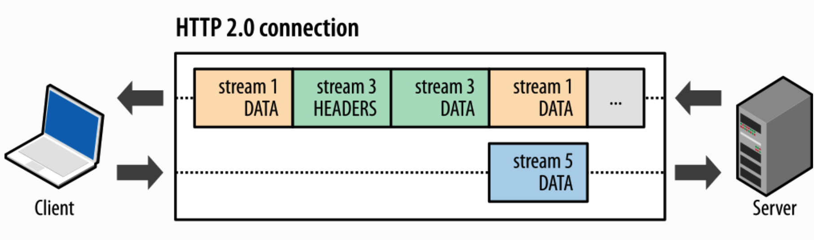
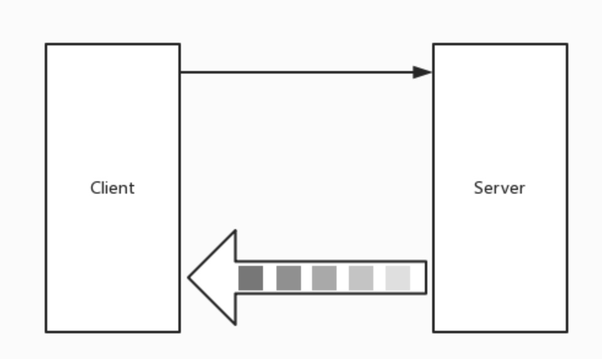
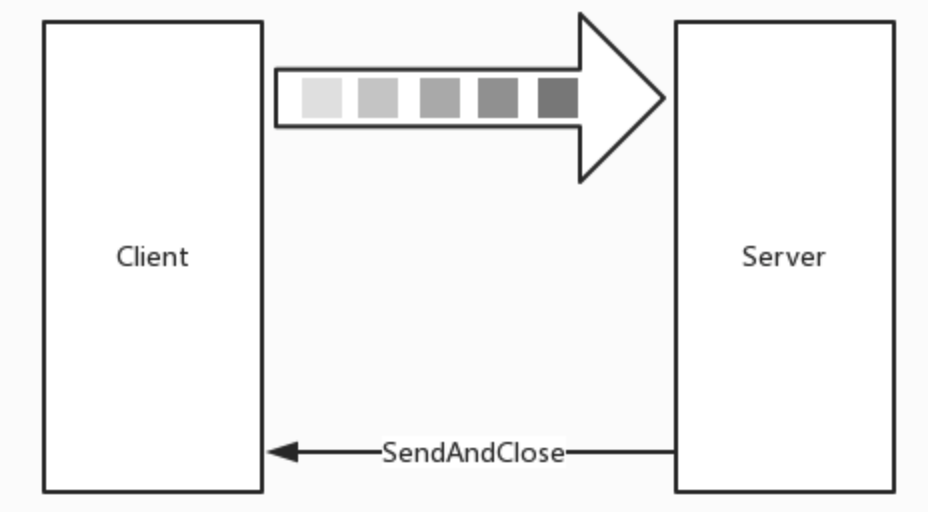
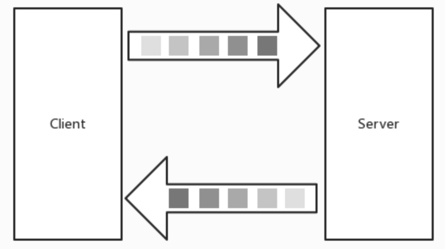

# gRPC流

## Simple RPC

一个简单的RPC，客户端使用存根将请求发送到服务器，然后等待响应返回，就像正常的函数调用一样。

### 使用Simple RPC的问题

+ 数据包过大造成压力
+ 接收数据包时，需要所有数据包都接受成功且正确后，才能够回调响应，进行业务处理（无法客户端边发送，服务端边处理）


# 流

### 为什么使用流

+ 大规模数据包
+ 实时场景



让我们来模拟一个场景，服务端存储了`<id,studentInfo>`。`id`是编号，`studentInfo`是学生的一些信息,包括`name`,`age`两个属性

### 服务端流式RPC（*server-side streaming*  RPC）

服务器端流式RPC，客户端在其中向服务器发送请求，并获取流以读取回一系列消息。客户端从返回的流中读取，直到没有更多消息为止。如我们的示例所示，您可以通过将`stream`关键字放在响应类型之前来指定服务器端流方法。


### 客户端流（*client-side streaming RPC*）

客户端流式RPC，客户端在其中编写一系列消息，然后再次使用提供的流将它们发送到服务器。客户端写完消息后，它将等待服务器读取所有消息并返回其响应。通过将`stream`关键字放在请求类型之前，可以指定客户端流方法。


### 双向流式RPC（*bidirectional streaming RPC*）

双向流式RPC，双方都使用读写流发送一系列消息。这两个流独立运行，因此客户端和服务器可以按照自己喜欢的顺序进行读写：例如，服务器可以在写响应之前等待接收所有客户端消息，或者可以先读取消息再写入消息，或读写的其他组合。每个流中的消息顺序都会保留。您可以通过在请求和响应之前都放置`stream`关键字来指定这种类型的方法。


### IDL

写入如下的`stream.proto`文件

```protobuf
syntax = "proto3";

package streamProto;

//option go_package = "./";

service StreamService{
  // 服务端流式RPC, request: StreamRangeRequest. response: StreamStuResponse.
  // List 返回所有查询范围内的 student 信息
  rpc List(StreamRangeRequest)returns (stream StreamStuResponse){};

  // 客户端流式RPC，request: StreamUpdateRequest. response: StreamOKResponse.
  // Update 更新服务端学生信息,根据id更新age.
  rpc Update(stream StreamUpdateRequest) returns(StreamOKResponse){};

  // 双向流式RPC, request: StreamRangeRequest. response: StreamStuResponse.
  // Check 根据请求的范围返回信息
  rpc Check(stream StreamRangeRequest)returns(stream StreamStuResponse){};

}

message StreamRangeRequest{
  // 请求从begin-end的信息
  int32 begin = 1;
  int32 end = 2;
}

message StreamStuResponse{
  // 学生信息
  string name = 1;
  int32 age = 2;
}

message StreamUpdateRequest{
  // 更新服务端学生信息,根据id更新age
  int32 id = 1;
  int32 age = 2;
}

message StreamOKResponse{
  // 返回更新成功个数
  int32 OK = 1;
}
```


### 服务端流式RPC

服务器端流式 RPC，显然是单向流，并代指 Server 为 Stream 而 Client 为普通 RPC 请求

简单来讲就是客户端发起一次普通的 RPC 请求，服务端通过流式响应多次发送数据集，客户端 Recv 接收数据集。大致如图：



**Server**

```go
func (s *StreamService) List(r *pb.StreamRangeRequest, stream pb.StreamService_ListServer) error {
	begin := r.GetBegin()
	end := r.GetEnd()

	// 如果有这个id,将信息发送给客户端
	for i := begin; i <= end; i++ {
		if info, ok := studentInfo[i]; ok {
			err := stream.Send(&pb.StreamStuResponse{
				Name: info.name,
				Age:  int32(info.age),
			})
			if err != nil {
				return err
			}
		}
	}
	return nil
}
```

- 消息体（对象）序列化
- 压缩序列化后的消息体
- 对正在传输的消息体增加 5 个字节的 header
- 判断压缩+序列化后的消息体总字节长度是否大于预设的 maxSendMessageSize（预设值为 `math.MaxInt32`），若超出则提示错误
- 写入给流的数据集


**Client**

```go
func List(client pb.StreamServiceClient, begin, end int32) {
	stream, err := client.List(context.Background(), &pb.StreamRangeRequest{
		Begin: begin,
		End:   end,
	})
	if err != nil {
		log.Fatalf("grpc.List err: %v", err)
	}
	for {
		stuInfo, err := stream.Recv()
		if err == io.EOF {
			break
		}
		if err != nil {
			log.Fatalf("%v.List(_) = _, %v", client, err)
		}
		log.Println(stuInfo.Name, stuInfo.Age)
	}
}
```

（1）RecvMsg 是阻塞等待的

（2）RecvMsg 当流成功/结束（调用了 Close）时，会返回 `io.EOF`

（3）RecvMsg 当流出现任何错误时，流会被中止，错误信息会包含 RPC 错误码。而在 RecvMsg 中可能出现如下错误：

- io.EOF
- io.ErrUnexpectedEOF
- transport.ConnectionError
- google.golang.org/grpc/codes

同时需要注意，默认的 MaxReceiveMessageSize 值为 1024 _ 1024 _ 4，建议不要超出


**运行**

服务端预先写入了一些内容

```go
// 存储学生信息
var studentInfo = map[int32]*stuInfo{}

func init() {
	// 初始化一些数据
	studentInfo[1] = &stuInfo{
		name: "张三",
		age:  23,
	}
	studentInfo[2] = &stuInfo{
		name: "李四",
		age:  30,
	}
}

type stuInfo struct {
	name string
	age  int
}
```

客户端请求数据

```
2021/05/19 21:13:19 张三 23
2021/05/19 21:13:19 李四 30
```


### 客户端流式RPC

客户端流式 RPC，单向流，客户端通过流式发起**多次** RPC 请求给服务端，服务端发起**一次**响应给客户端，大致如图：



**Server**

```go
func (s *StreamService) Update(stream pb.StreamService_UpdateServer) error {
	var okCount int32
	for {
		stuInfo, err := stream.Recv()
		if err == io.EOF {
			return stream.SendAndClose(&pb.StreamOKResponse{OK: int32(okCount)})
		}
		if err != nil {
			return err
		}
		id := stuInfo.GetId()
		if _, ok := studentInfo[id]; ok {
			studentInfo[id].age = int(stuInfo.GetAge())
			okCount++
		}
	}
	return nil
}

```

多了一个从未见过的方法 `stream.SendAndClose`，它是做什么用的呢？

在这段程序中，我们对每一个 Recv 都进行了处理，当发现 `io.EOF` (流关闭) 后，需要将最终的响应结果发送给客户端，同时关闭正在另外一侧等待的 Recv


**Client**

```go
func List(client pb.StreamServiceClient, begin, end int32) {
	stream, err := client.List(context.Background(), &pb.StreamRangeRequest{
		Begin: begin,
		End:   end,
	})
	if err != nil {
		log.Fatalf("grpc.List err: %v", err)
	}
	for {
		stuInfo, err := stream.Recv()
		if err == io.EOF {
			break
		}
		if err != nil {
			log.Fatalf("%v.List(_) = _, %v", client, err)
		}
		log.Println(stuInfo.Name, stuInfo.Age)
	}
}

```

`stream.CloseAndRecv` 和 `stream.SendAndClose` 是配套使用的流方法，相信聪明的你已经秒懂它的作用了


**运行**

```
2021/05/19 21:41:50 更改成功数量 2
```


### 双向流式RPC

双向流式 RPC，顾名思义是双向流。由客户端以流式的方式发起请求，服务端同样以流式的方式响应请求

首个请求一定是 Client 发起，但具体交互方式（谁先谁后、一次发多少、响应多少、什么时候关闭）根据程序编写的方式来确定（可以结合协程）

假设该双向流是**按顺序发送**的话，大致如图：



因程序编写的不同而不同。**双向流图示无法适用不同的场景**


**server**

```go
func (s *StreamService) Check(stream pb.StreamService_CheckServer) error {
	for {
		req, err := stream.Recv()
		if err == io.EOF {
			return nil
		}
		if err != nil {
			return err
		}

		begin, end := req.GetBegin(), req.GetEnd()
		for i := begin; i <= end; i++ {
			if info, ok := studentInfo[i]; ok {
				err := stream.Send(&pb.StreamStuResponse{
					Name: info.name,
					Age:  int32(info.age),
				})
				if err != nil {
					return err
				}
			}
		}

	}
	return nil
}

```


**client**

```go
func Check(client pb.StreamServiceClient) {
	stream, err := client.Check(context.Background())
	if err != nil {
		log.Fatalf("%v.Update(_) = _, %v", client, err)
	}

	waitc := make(chan interface{})

	go func() {
		// 接收消息
		for {
			info, err := stream.Recv()
			if err == io.EOF {
				// read done.
				close(waitc)
				return
			}
			if err != nil {
				log.Fatalf("Failed to receive a note : %v", err)
			}
			log.Printf("Got message of Student(%s, %d)", info.Name, info.Age)
		}
	}()

	for i := 0; i < 1; i++ {
		if err := stream.Send(&pb.StreamRangeRequest{Begin: int32(i + 1), End: int32(i + 2)}); err != nil {
			log.Fatalf("Failed to send a message : %v", err)
		}
	}
	stream.CloseSend()
	fmt.Printf("here")
	<-waitc
}

```


**运行**

```
here2021/05/19 22:01:34 Got message of Student(张三, 10)
2021/05/19 22:01:34 Got message of Student(李四, 20)
```

