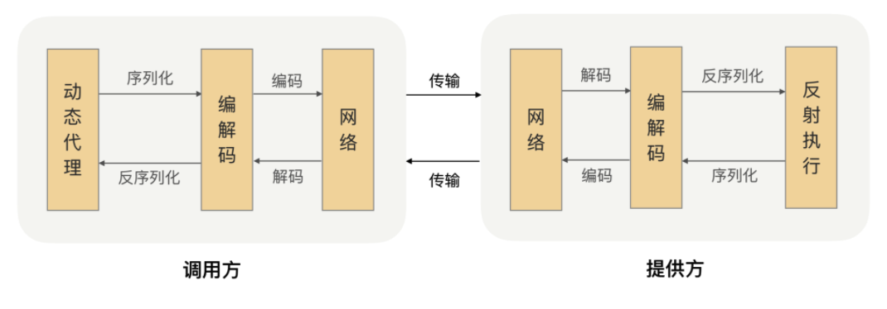

# myRPC
深入Go的学习后离不开的一个话题就是微服务

RPC 的全称是 Remote Procedure Call，即远程过程调用。简单解读字面上的意思，远程肯定是指要跨机器而非本机，所以需要用到网络编程才能实现，但是不是只要通过网络通信访问到另一台机器的应用程序，就可以称之为 RPC 调用了？显然并不够。

我们通常见到的架构类型，我称为（巨石架构），所有接口和方法都在本地，调用起来十分的方便。但是业务大了怎么办，一次部署就要编译很久，如果用户变多，一台服务器能不能应付的过来，这时候就要开始考虑分布式微服务的问题。问题出现了，接口和方法不在本地了，一个服务可能在另一个服务器上部署运行，怎么办？

我理解的 RPC 是帮助我们屏蔽网络编程细节，实现调用远程方法就跟调用本地（同一个项目中的方法）一样的体验，我们不需要因为这个方法是远程调用就需要编写很多与业务无关的代码。

RPC 的作用就是体现在这样两个方面：

+ 屏蔽远程调用跟本地调用的区别，让我们感觉就是调用项目内的方法；

+ 隐藏底层网络通信的复杂性，让我们更专注于业务逻辑。

## 学习大纲

本次学习是参照 `极客兔兔的 7天从零系列`，搞懂原理和方法，尝试手动实现一个简单的RPC。

目录如下:

|         目录         |                             文档                             | 是否完成 |
| :------------------: | :----------------------------------------------------------: | :------: |
|  1.服务端与消息编码  | [服务端与消息编码](https://github.com/Yefangbiao/rpc/tree/main/myRPC/doc/1-消息编码与服务端.md) |    ✔️     |
|    2.高性能客户端    | [高性能客户端](https://github.com/Yefangbiao/rpc/tree/main/myRPC/doc/2-高性能客户端.md) |    ✔️     |
|      3.服务注册      | [服务注册](https://github.com/Yefangbiao/rpc/tree/main/myRPC/doc/3-服务注册.md) |    ✔️     |
|      4.超时处理      | [超时处理](https://github.com/Yefangbiao/rpc/tree/main/myRPC/doc/4-超时处理.md) |    ✔️     |
|    5.支持HTTP协议    | [支持HTTP](https://github.com/Yefangbiao/rpc/tree/main/myRPC/doc/5-支持HTTP协议.md) |    ✔️     |
|      6.负载均衡      |                                                              |          |
| 7.服务发现与注册中心 |                                                              |          |

## RPC通信流程

我们已经知道 RPC 是一个远程调用，那肯定就需要通过网络来传输数据，并且 RPC 常用于业务系统之间的数据交互，需要保证其可靠性，所以 RPC 一般默认采用 TCP 来传输。我们常用的 HTTP 协议也是建立在 TCP 之上的。

网络传输的数据必须是二进制数据，但调用方请求的出入参数都是对象。对象是肯定没法直接在网络中传输的，需要提前把它转成可传输的二进制，并且要求转换算法是可逆的，这个过程我们一般叫做“序列化”。

调用方持续地把请求参数序列化成二进制后，经过 TCP 传输给了服务提供方。服务提供方从 TCP 通道里面收到二进制数据，那如何知道一个请求的数据到哪里结束，是一个什么类型的请求呢？

在这里我们可以想想高速公路，它上面有很多出口，为了让司机清楚地知道从哪里出去，管理部门会在路上建立很多指示牌，并在指示牌上标明下一个出口是哪里、还有多远。那回到数据包识别这个场景，我们是不是也可以建立一些“指示牌”，并在上面标明数据包的类型和长度，这样就可以正确的解析数据了。确实可以，并且我们把数据格式的约定内容叫做“协议”。大多数的协议会分成两部分，分别是数据头和消息体。数据头一般用于身份识别，包括协议标识、数据大小、请求类型、序列化类型等信息；消息体主要是请求的业务参数信息和扩展属性等。

根据协议格式，服务提供方就可以正确地从二进制数据中分割出不同的请求来，同时根据请求类型和序列化类型，把二进制的消息体逆向还原成请求对象。这个过程叫作“反序列化”。

服务提供方再根据反序列化出来的请求对象找到对应的实现类，完成真正的方法调用，然后把执行结果序列化后，回写到对应的 TCP 通道里面。调用方获取到应答的数据包后，再反序列化成应答对象，这样调用方就完成了一次 RPC 调用。

## 参考内容

+ [极客兔兔-7天用Go从零实现系列](https://github.com/geektutu/7days-golang)

